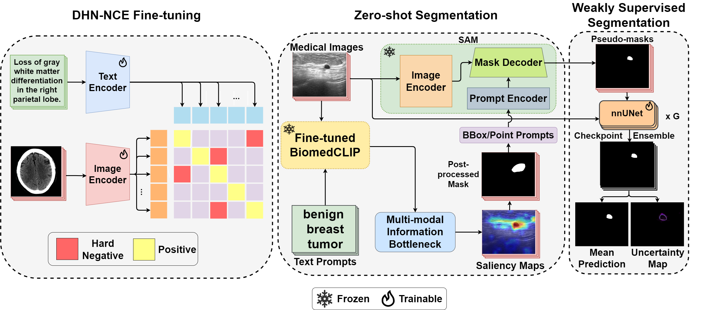
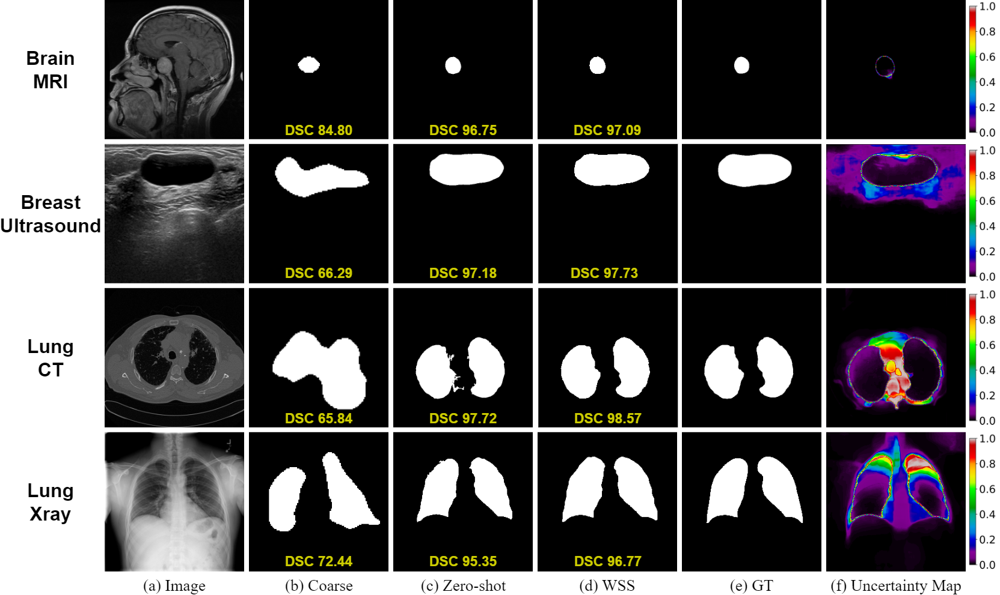

# MedSAM


### Framework

<p float="left">
  
</p>

### Sample Segmentation Results
<p float="left">
  
</p>

## Datasets
Public datasets used in our study:
- [Radiology Objects in COntext (ROCO)](https://github.com/razorx89/roco-dataset)
- [MedPix](https://drive.google.com/file/d/1wzTMiSLch0nNpoi20nayRIkziLgSVStC/view?usp=sharing)
- [Breast UltraSound Images (BUSI)](https://www.kaggle.com/datasets/aryashah2k/breast-ultrasound-images-dataset)
- [UDIAT](https://drive.google.com/file/d/1txsA6eNFZciIrbqzwS3uOcnnkiEh3Pt4/view?usp=drive_link)
- [COVID-QU-Ex](https://www.kaggle.com/datasets/anasmohammedtahir/covidqu)
- [Brain Tumors](https://www.kaggle.com/datasets/ashkhagan/figshare-brain-tumor-dataset)
- [Lung CT](https://www.kaggle.com/datasets/polomarco/chest-ct-segmentation)

You can download the segmentation datasets [here](https://drive.google.com/file/d/1uYtyg3rClE-XXPNuEz7s6gYq2p48Z08p/view?usp=sharing).

Create a directory for your data that you want to work with in the main working directory like the following:

```shell
data
├── breast_tumors
│   ├── train_images           
│   ├── train_masks             
│   ├── val_images        
│   ├── val_masks         
│   ├── test_images       
│   └── test_masks        
│
├── brain_tumors
│   ├── train_images            
│   ├── train_masks            
│   ├── val_images        
│   ├── val_masks         
│   ├── test_images       
│   └── test_masks        
│
└── ...        
```

## Colab Demo

Interactive Colab demo: [](https://colab.research.google.com/drive/1Hf_ticAbO7Oyh5Rat2XqQ-FAkm4vk3RQ?usp=sharing)

## Prerequisites & Installation
Install anaconda following the [anaconda installation documentation](https://docs.anaconda.com/anaconda/install/).
Create an environment with all required packages with the following command :
```bashscript
conda env create -f medclipsamv2_env.yml
conda activate medclipsamv2
```
then setup the segment-anything library:
```bashscript
cd segment-anything
pip install -e .
cd ..
```
finally setup the nnUNet framework:
```bashscript
cd weak_segmentation
pip install -e .
cd ..
```

### <a name="Models"></a>SAM Model Checkpoints

Three model versions of the SAM model are available with different backbone sizes. These models can be instantiated by running

Click the links below to download the checkpoint for the corresponding model type and place it at `segment-anything/sam_checkpoints/sam_vit_h_4b8939.pth`

- **`default` or `vit_h`: [ViT-H SAM model.](https://dl.fbaipublicfiles.com/segment_anything/sam_vit_h_4b8939.pth)**
- `vit_l`: [ViT-L SAM model.](https://dl.fbaipublicfiles.com/segment_anything/sam_vit_l_0b3195.pth)
- `vit_b`: [ViT-B SAM model.](https://dl.fbaipublicfiles.com/segment_anything/sam_vit_b_01ec64.pth)

## How to run
### DHN-NCE Loss
You can fine-tune the BiomedCLIP pre-trained model using our [DHN-NCE Loss](https://github.com/HealthX-Lab/MedCLIP-SAMv2/tree/main/loss).

Place your image-text dataset in `biomedclip_finetuning/open_clip/src/data` (please refer to the [MedPix](https://drive.google.com/file/d/1wzTMiSLch0nNpoi20nayRIkziLgSVStC/view?usp=sharing) dataset to see how your custom dataset should be structured)

You can then start fine-tuning BiomedCLIP like this:
```bash
bash biomedclip_finetuning/scripts/biomedclip.sh
```

If you have the model saved with the `.pt` format, you can convert it to `.bin` by moving the saved model checkpoint to `saliency_maps/model` and then calling:

```python
python saliency_maps/model/convert.py
```

Our fine-tuned model can be downloaded [here](https://drive.google.com/file/d/1jjnZabUlc9_gpcP0d2nz_GNS-EGX0lq5/view?usp=sharing). Place it at `saliency_maps/model/pytorch_model.bin`

### Zero-shot Segmentation
You can run the whole zero-shot framework with the following:

```bashscript
bash zeroshot.sh <path/to/dataset>
```
You can change the settings by specifying which CLIP model you want to use, the post-processing algorithm, the SAM model and the type of visual prompts to use (boxes/points/both).

The text prompts we used can be found [here](https://github.com/HealthX-Lab/MedCLIP-SAMv2/blob/main/saliency_maps/text_prompts.py).

Some zeroshot_scripts to reproduce the results are found at `zeroshot_scripts`.

### Weakly Supervised Segmentation

Go to `weak_segmentation`:

```bashscript
cd weak_segmentation
```

#### Dataset Prepartion
Please follow this [guideline](https://github.com/MIC-DKFZ/nnUNet/blob/master/documentation/dataset_format.md) to prepare your datasets. Place all your prepared datasets in `data`.

#### Preprocessing

```bash
nnUNetv2_plan_and_preprocess -d DATASET_ID --verify_dataset_integrity
```

#### Training
```bash
nnUNetv2_train DATASET_ID 2d all --npz --num_epochs EPOCHS --num_of_cycles CYCLES
```

#### Inference and Uncertainty

```bash
nnUNetv2_predict_from_folder --dataset DATASET_ID --fold all --input_folder INPUT_PATH --output_folder OUTPUT_PATH --rule RULE
```

```bash
nnUNetv2_run_uncertainty_on_fold --proba_dir PATH --raw_path PATH --labels PATH --score_type TYPE --output_pred_path PATH
```


